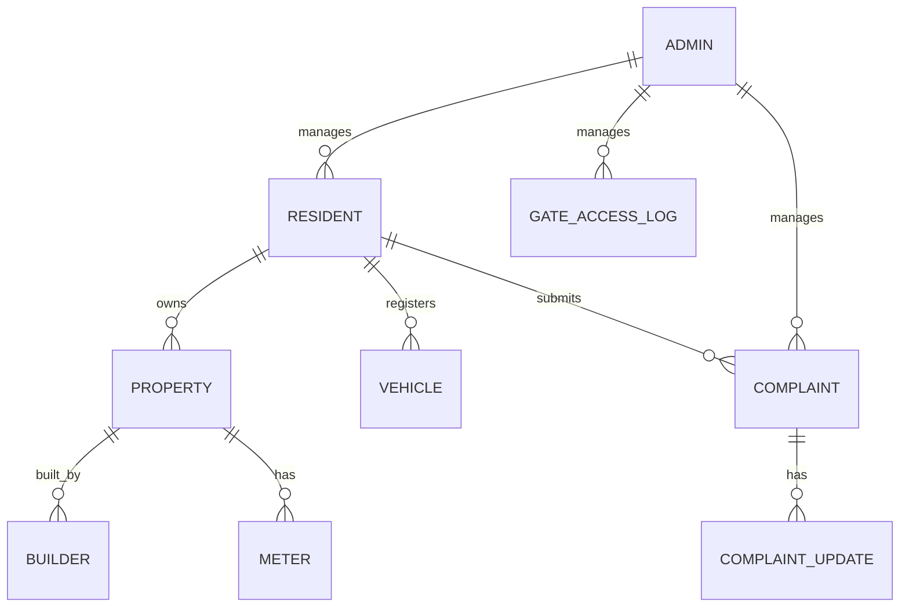

# Altona Village Community Management System - Database Schema Design

## 1. Introduction

This document details the database schema for the Altona Village Community Management System. It outlines the tables, their respective columns, data types, relationships, and constraints. The design aims to be robust, scalable, and efficient for managing all community-related data.

## 2. Database Choice

**PostgreSQL** is chosen as the relational database management system (RDBMS) due to its robustness, advanced features, scalability, and strong support for data integrity. It is well-suited for complex applications requiring reliable data storage and retrieval.

## 3. Entity-Relationship Diagram (ERD) - Conceptual

## 4. Table Definitions

### 4.1. `users` Table

This table will store user authentication and basic profile information for both residents and administrators.

| Column Name      | Data Type    | Constraints                  | Description                                    |
| :--------------- | :----------- | :--------------------------- | :--------------------------------------------- |
| `id`             | `UUID`       | `PRIMARY KEY`, `NOT NULL`    | Unique identifier for the user                 |
| `email`          | `VARCHAR(255)` | `NOT NULL`, `UNIQUE`         | User's email address (used for login)          |
| `password_hash`  | `VARCHAR(255)` | `NOT NULL`                   | Hashed password                                |
| `role`           | `VARCHAR(50)`  | `NOT NULL`, `DEFAULT 'resident'` | User's role (e.g., 'resident', 'admin')        |
| `status`         | `VARCHAR(50)`  | `NOT NULL`, `DEFAULT 'pending'` | Account status (e.g., 'pending', 'active', 'inactive') |
| `created_at`     | `TIMESTAMP`  | `NOT NULL`, `DEFAULT CURRENT_TIMESTAMP` | Timestamp of user creation                     |
| `updated_at`     | `TIMESTAMP`  | `NOT NULL`, `DEFAULT CURRENT_TIMESTAMP` | Timestamp of last update                       |

### 4.2. `residents` Table

This table will store detailed personal information for residents.

| Column Name      | Data Type    | Constraints                  | Description                                    |
| :--------------- | :----------- | :--------------------------- | :--------------------------------------------- |
| `id`             | `UUID`       | `PRIMARY KEY`, `NOT NULL`    | Unique identifier for the resident             |
| `user_id`        | `UUID`       | `NOT NULL`, `UNIQUE`, `FOREIGN KEY (users.id)` | Foreign key to the `users` table               |
| `first_name`     | `VARCHAR(100)` | `NOT NULL`                   | Resident's first name                          |
| `last_name`      | `VARCHAR(100)` | `NOT NULL`                   | Resident's last name                           |
| `phone_number`   | `VARCHAR(20)`  | `NULLABLE`                   | Resident's primary phone number                |
| `emergency_contact_name` | `VARCHAR(255)` | `NULLABLE`                   | Name of emergency contact                      |
| `emergency_contact_number` | `VARCHAR(20)`  | `NULLABLE`                   | Phone number of emergency contact              |
| `is_owner`       | `BOOLEAN`    | `NOT NULL`                   | True if owner, False if tenant                 |
| `moving_in_date` | `DATE`       | `NULLABLE`                   | Date resident moved in                         |
| `moving_out_date`| `DATE`       | `NULLABLE`                   | Date resident moved out                        |
| `created_at`     | `TIMESTAMP`  | `NOT NULL`, `DEFAULT CURRENT_TIMESTAMP` | Timestamp of record creation                   |
| `updated_at`     | `TIMESTAMP`  | `NOT NULL`, `DEFAULT CURRENT_TIMESTAMP` | Timestamp of last update                       |

### 4.3. `properties` Table

This table will store information about each property in Altona Village.

| Column Name      | Data Type    | Constraints                  | Description                                    |
| :--------------- | :----------- | :--------------------------- | :--------------------------------------------- |
| `id`             | `UUID`       | `PRIMARY KEY`, `NOT NULL`    | Unique identifier for the property             |
| `erf_number`     | `VARCHAR(50)`  | `NOT NULL`, `UNIQUE`         | Erf number of the property                     |
| `address`        | `VARCHAR(255)` | `NOT NULL`                   | Full address of the property                   |
| `resident_id`    | `UUID`       | `NULLABLE`, `FOREIGN KEY (residents.id)` | Foreign key to the `residents` table (current occupant) |
| `plot_registered_date` | `DATE`       | `NULLABLE`                   | Date the empty plot was registered             |
| `created_at`     | `TIMESTAMP`  | `NOT NULL`, `DEFAULT CURRENT_TIMESTAMP` | Timestamp of record creation                   |
| `updated_at`     | `TIMESTAMP`  | `NOT NULL`, `DEFAULT CURRENT_TIMESTAMP` | Timestamp of last update                       |

### 4.4. `vehicles` Table

This table will store vehicle information for gate access control.

| Column Name      | Data Type    | Constraints                  | Description                                    |
| :--------------- | :----------- | :--------------------------- | :--------------------------------------------- |
| `id`             | `UUID`       | `PRIMARY KEY`, `NOT NULL`    | Unique identifier for the vehicle              |
| `resident_id`    | `UUID`       | `NOT NULL`, `FOREIGN KEY (residents.id)` | Foreign key to the `residents` table           |
| `registration_number` | `VARCHAR(50)`  | `NOT NULL`, `UNIQUE`         | Vehicle registration number                    |
| `make`           | `VARCHAR(100)` | `NULLABLE`                   | Vehicle make                                   |
| `model`          | `VARCHAR(100)` | `NULLABLE`                   | Vehicle model                                  |
| `color`          | `VARCHAR(50)`  | `NULLABLE`                   | Vehicle color                                  |
| `created_at`     | `TIMESTAMP`  | `NOT NULL`, `DEFAULT CURRENT_TIMESTAMP` | Timestamp of record creation                   |
| `updated_at`     | `TIMESTAMP`  | `NOT NULL`, `DEFAULT CURRENT_TIMESTAMP` | Timestamp of last update                       |

### 4.5. `builders` Table

This table will store information about builders and construction projects.

| Column Name      | Data Type    | Constraints                  | Description                                    |
| :--------------- | :----------- | :--------------------------- | :--------------------------------------------- |
| `id`             | `UUID`       | `PRIMARY KEY`, `NOT NULL`    | Unique identifier for the builder              |
| `property_id`    | `UUID`       | `NOT NULL`, `UNIQUE`, `FOREIGN KEY (properties.id)` | Foreign key to the `properties` table          |
| `company_name`   | `VARCHAR(255)` | `NOT NULL`                   | Builder company name                           |
| `contact_person` | `VARCHAR(255)` | `NULLABLE`                   | Primary contact person for the builder         |
| `contact_number` | `VARCHAR(20)`  | `NULLABLE`                   | Contact number for the builder                 |
| `building_start_date` | `DATE`       | `NULLABLE`                   | Date construction started                      |
| `building_end_date` | `DATE`       | `NULLABLE`                   | Date construction ended                        |
| `created_at`     | `TIMESTAMP`  | `NOT NULL`, `DEFAULT CURRENT_TIMESTAMP` | Timestamp of record creation                   |
| `updated_at`     | `TIMESTAMP`  | `NOT NULL`, `DEFAULT CURRENT_TIMESTAMP` | Timestamp of last update                       |

### 4.6. `meters` Table

This table will store water and power meter numbers associated with properties.

| Column Name      | Data Type    | Constraints                  | Description                                    |
| :--------------- | :----------- | :--------------------------- | :--------------------------------------------- |
| `id`             | `UUID`       | `PRIMARY KEY`, `NOT NULL`    | Unique identifier for the meter                |
| `property_id`    | `UUID`       | `NOT NULL`, `FOREIGN KEY (properties.id)` | Foreign key to the `properties` table          |
| `meter_type`     | `VARCHAR(50)`  | `NOT NULL`, `CHECK ('water', 'power')` | Type of meter (e.g., 'water', 'power')         |
| `meter_number`   | `VARCHAR(100)` | `NOT NULL`, `UNIQUE`         | Unique meter number                            |
| `installation_date` | `DATE`       | `NULLABLE`                   | Date meter was installed                       |
| `created_at`     | `TIMESTAMP`  | `NOT NULL`, `DEFAULT CURRENT_TIMESTAMP` | Timestamp of record creation                   |
| `updated_at`     | `TIMESTAMP`  | `NOT NULL`, `DEFAULT CURRENT_TIMESTAMP` | Timestamp of last update                       |

### 4.7. `complaints` Table

This table will store resident complaints and requests.

| Column Name      | Data Type    | Constraints                  | Description                                    |
| :--------------- | :----------- | :--------------------------- | :--------------------------------------------- |
| `id`             | `UUID`       | `PRIMARY KEY`, `NOT NULL`    | Unique identifier for the complaint            |
| `resident_id`    | `UUID`       | `NOT NULL`, `FOREIGN KEY (residents.id)` | Foreign key to the `residents` table           |
| `subject`        | `VARCHAR(255)` | `NOT NULL`                   | Subject of the complaint                       |
| `description`    | `TEXT`       | `NOT NULL`                   | Detailed description of the complaint          |
| `status`         | `VARCHAR(50)`  | `NOT NULL`, `DEFAULT 'open'` | Current status (e.g., 'open', 'in progress', 'closed') |
| `priority`       | `VARCHAR(50)`  | `NULLABLE`                   | Priority level (e.g., 'low', 'medium', 'high') |
| `assigned_to`    | `UUID`       | `NULLABLE`, `FOREIGN KEY (users.id)` | Foreign key to `users` table (admin assigned)  |
| `created_at`     | `TIMESTAMP`  | `NOT NULL`, `DEFAULT CURRENT_TIMESTAMP` | Timestamp of complaint submission              |
| `updated_at`     | `TIMESTAMP`  | `NOT NULL`, `DEFAULT CURRENT_TIMESTAMP` | Timestamp of last update                       |

### 4.8. `complaint_updates` Table

This table will store updates and communication related to complaints.

| Column Name      | Data Type    | Constraints                  | Description                                    |
| :--------------- | :----------- | :--------------------------- | :--------------------------------------------- |
| `id`             | `UUID`       | `PRIMARY KEY`, `NOT NULL`    | Unique identifier for the update               |
| `complaint_id`   | `UUID`       | `NOT NULL`, `FOREIGN KEY (complaints.id)` | Foreign key to the `complaints` table          |
| `user_id`        | `UUID`       | `NOT NULL`, `FOREIGN KEY (users.id)` | Foreign key to the `users` table (who made the update) |
| `update_text`    | `TEXT`       | `NOT NULL`                   | Content of the update                          |
| `created_at`     | `TIMESTAMP`  | `NOT NULL`, `DEFAULT CURRENT_TIMESTAMP` | Timestamp of the update                        |

### 4.9. `gate_access_logs` Table

This table will store logs of gate access events (for future expansion, if automated gate system integration is considered).

| Column Name      | Data Type    | Constraints                  | Description                                    |
| :--------------- | :----------- | :--------------------------- | :--------------------------------------------- |
| `id`             | `UUID`       | `PRIMARY KEY`, `NOT NULL`    | Unique identifier for the log entry            |
| `vehicle_id`     | `UUID`       | `NULLABLE`, `FOREIGN KEY (vehicles.id)` | Foreign key to the `vehicles` table (if known) |
| `access_time`    | `TIMESTAMP`  | `NOT NULL`                   | Timestamp of access                            |
| `access_type`    | `VARCHAR(50)`  | `NOT NULL`                   | Type of access (e.g., 'entry', 'exit')         |
| `gate_id`        | `VARCHAR(50)`  | `NULLABLE`                   | Identifier of the gate used                    |
| `notes`          | `TEXT`       | `NULLABLE`                   | Any additional notes                           |
| `created_at`     | `TIMESTAMP`  | `NOT NULL`, `DEFAULT CURRENT_TIMESTAMP` | Timestamp of record creation                   |

## 5. Relationships and Constraints

*   **One-to-One:**
    *   `users` to `residents`: Each user account can be associated with one resident profile.
*   **One-to-Many:**
    *   `residents` to `properties`: A resident can own/occupy one property (current design, can be extended for multiple properties).
    *   `residents` to `vehicles`: A resident can register multiple vehicles.
    *   `residents` to `complaints`: A resident can submit multiple complaints.
    *   `properties` to `meters`: A property can have multiple meters (water, power).
    *   `complaints` to `complaint_updates`: A complaint can have multiple updates.
*   **Foreign Keys:** All foreign key relationships will enforce referential integrity.
*   **Unique Constraints:** `email` in `users`, `erf_number` in `properties`, `registration_number` in `vehicles`, `meter_number` in `meters`, and `property_id` in `builders` will have unique constraints to prevent duplicate entries.

## 6. Data Migration Strategy

Existing Excel spreadsheets will be migrated to the new database. This will involve:

1.  **Data Cleaning:** Reviewing and cleaning existing data in Excel for consistency and accuracy.
2.  **Mapping:** Mapping Excel columns to the new database schema columns.
3.  **Scripting:** Developing Python scripts using libraries like `pandas` and a PostgreSQL client library (e.g., `psycopg2`) to read Excel data and insert it into the respective database tables.
4.  **Validation:** Post-migration validation to ensure all data has been transferred correctly and relationships are maintained.

## 7. Scalability Considerations

*   **UUIDs for Primary Keys:** Using UUIDs as primary keys provides better scalability in distributed systems and avoids issues with sequential IDs in concurrent environments.
*   **Indexing:** Appropriate indexing will be applied to frequently queried columns (e.g., `email`, `erf_number`, `resident_id`, `property_id`) to optimize query performance.
*   **Normalization:** The schema is designed with a normalized structure to reduce data redundancy and improve data integrity.

## 8. Conclusion

This database schema provides a solid foundation for the Altona Village Community Management System. It is designed to be flexible, scalable, and maintainable, supporting all the identified functional requirements and allowing for future enhancements. The choice of PostgreSQL ensures data reliability and performance.

