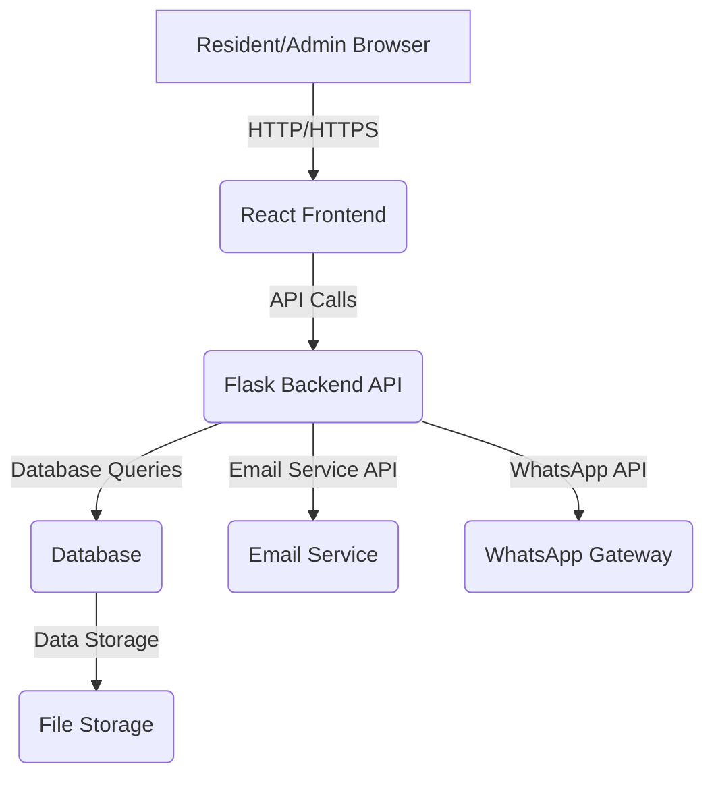

# Altona Village Community Management System - System Specifications

## 1. Introduction

This document outlines the detailed requirements and architectural design for the Altona Village Community Management System. The system aims to streamline administrative tasks, enhance communication between estate management and residents, and provide a self-service portal for residents.

## 2. Functional Requirements

### 2.1. User Management and Authentication

*   **Resident Registration:** New residents must be able to register for an account through a self-help portal. This process will require initial approval from estate management.
*   **User Roles:** The system will support at least two primary user roles: 'Resident' and 'Estate Manager' (Admin).
    *   **Resident:** Can view and update their personal information, property details, vehicle information, and submit complaints/requests. Can only access their own data.
    *   **Estate Manager (Admin):** Full access to all resident data, builder data, gate access logs, complaint management, and communication tools. Can approve new registrations, manage user accounts, and send bulk communications.
*   **Login/Logout:** Secure login and logout functionality for all users.
*   **Password Management:** Users must be able to reset their passwords.

### 2.2. Self-Help Portal (Resident Facing)

*   **Personal Information Management:** Residents can view and update their contact details (phone numbers, email addresses), emergency contacts, and other relevant personal information.
*   **Property Information:** Residents can view details related to their property (erf number, address).
*   **Vehicle Management:** Residents can add, update, or remove vehicle registration numbers for gate access control.
*   **Moving In/Out Forms:** Digital submission of moving in/out forms.
*   **Complaint/Request Submission:** Residents can submit complaints or service requests through a ticketing system. They should be able to track the status of their submissions.

### 2.3. Estate Management Dashboard (Admin Facing)

*   **Resident Database:** A comprehensive database of all residents, including erf number, address, owner/tenant details, contact information, and other relevant data. This will replace the current Excel spreadsheet.
*   **Builder Database:** A database to manage builder information, including water/power meter numbers, building start dates, and plot registration details.
*   **Gate Register Management:** Ability to manage and generate the gate register for security personnel. This should pull relevant information from the resident database.
*   **New Registration Approval:** A mechanism for estate managers to review and approve new resident registrations.
*   **Complaint/Ticketing System:** A system to manage resident complaints and requests, assign them to relevant personnel, track their status, and communicate updates to residents via email.
*   **Communication Tools:**
    *   **Email Communication:** Ability to send bulk emails to all residents or specific groups of residents (e.g., owners, tenants, specific sections).
    *   **WhatsApp Integration:** Ability to link cellphone numbers to a WhatsApp group for mass communication.
*   **Reporting:** Generate reports on resident data, complaints, and other relevant metrics.

### 2.4. Data Management

*   **Centralized Database:** All data will be stored in a centralized database, replacing existing spreadsheets.
*   **Data Import/Export:** Ability to import existing data (e.g., from Excel spreadsheets) and export data for reporting or backup purposes.
*   **Data Validation:** Implement data validation to ensure data integrity and accuracy.
*   **Scalability:** The database design must be scalable to accommodate future growth of the estate.

## 3. Non-Functional Requirements

### 3.1. Performance

*   The system should be responsive, with quick loading times for pages and data.
*   Database queries should be optimized for efficient retrieval of information.

### 3.2. Security

*   **Authentication and Authorization:** Implement robust authentication and authorization mechanisms to ensure only authorized users can access specific data and functionalities.
*   **Data Encryption:** Sensitive data (e.g., passwords, personal information) should be encrypted both in transit and at rest.
*   **Access Control:** Granular access control based on user roles.
*   **Audit Trails:** Log significant system activities for auditing purposes.

### 3.3. Usability

*   **Intuitive User Interface:** The self-help portal and admin dashboard should have a user-friendly and intuitive interface.
*   **Responsive Design:** The web application must be accessible and functional across various devices (desktops, tablets, mobile phones).

### 3.4. Scalability and Maintainability

*   **Modular Architecture:** The system should be designed with a modular architecture to facilitate future expansion and maintenance.
*   **Code Quality:** Adhere to best practices for code quality, readability, and maintainability.
*   **Technology Stack:** Use modern and widely supported technologies (Flask for backend, React for frontend).

### 3.5. Integration

*   **GitHub:** Version control and collaboration using GitHub.
*   **Render:** Deployment of the web application on Render.
*   **Email Service:** Integration with an email service provider for sending notifications and bulk emails.
*   **WhatsApp API:** Exploration of WhatsApp API for communication (note: direct WhatsApp group integration might be challenging due to API limitations, alternative solutions might be explored).

## 4. System Architecture

### 4.1. High-Level Architecture

The system will follow a client-server architecture, with a React-based frontend and a Flask-based backend API. The database will be a relational database (e.g., PostgreSQL or MySQL) to ensure data integrity and scalability.

### 4.2. Technology Stack

*   **Frontend:** React.js
*   **Backend:** Flask (Python)
*   **Database:** PostgreSQL (recommended for scalability and features)
*   **Deployment:** Render
*   **Version Control:** GitHub
*   **Communication:** SMTP for Email, potentially a third-party WhatsApp API provider.

## 5. Data Flow

### 5.1. New Resident Registration

1.  Resident accesses the self-help portal and fills out the registration form.
2.  Frontend sends registration data to the Flask backend API.
3.  Backend validates data and stores it in the database with a 'pending' status.
4.  Estate Manager receives a notification about a new registration.
5.  Estate Manager reviews the registration and approves/rejects it via the admin dashboard.
6.  Upon approval, the resident's account is activated, and they receive a welcome email.

### 5.2. Data Update by Resident

1.  Resident logs into the self-help portal.
2.  Resident navigates to their profile and updates information (e.g., phone number, vehicle).
3.  Frontend sends update request to the Flask backend API.
4.  Backend validates and updates the database.
5.  Changes are reflected in the resident's portal and accessible to the Estate Manager.

### 5.3. Complaint Submission

1.  Resident submits a complaint via the self-help portal.
2.  Frontend sends complaint details to the Flask backend API.
3.  Backend stores the complaint in the database and assigns a unique ticket ID.
4.  Estate Manager is notified of the new complaint.
5.  Estate Manager manages the complaint through the admin dashboard, updating its status and adding notes.
6.  Updates to the complaint status or responses are communicated to the resident via email.

## 6. Future Enhancements

*   Integration with payment gateways for levy payments.
*   Community forum or notice board.
*   Booking system for estate facilities.
*   Integration with smart home devices (e.g., for utility meter readings).

## 7. Conclusion

This document provides a foundational understanding of the Altona Village Community Management System. The outlined architecture and requirements will guide the development process, ensuring a robust, scalable, and user-friendly solution that meets the needs of both residents and estate management.

